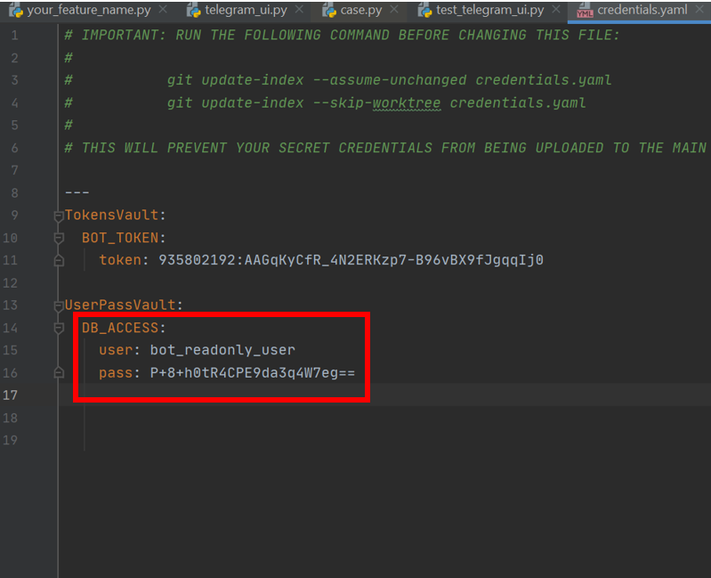

# עבודה על הDB האישי 
דף זה יפרט לעומק כיצד ניתן לשמור ולקבל מידע מה-DB האישי של הפיצ'ר שלכם (הבהרה: מודל = DB)
<div dir="rtl" align="right">

[[_TOC_]]

</div>

## הגדרת התחברות לDB
אתם צריכים לקבל שם משתמש וסיסמא וצוות הבוט. לאחר מכן

הגדרת ההתחברות לDB צריכה להיעשות דרך שקובץ credentials.yaml.  הוא צריך להיראות כך:



באדום מסומנים השדות שאתם צריכים לשנות לפי הפרטים שתקבלו מהצוות.

## יצירת מודל

ה-DB האישי שלכם צריך להיות בעל מבנה מסויים שאתם תגדירו אותו.

נניח שנרצה ליצור DB ששומר מכוניות של חניכים. השדות שלו הם: מספר רכב, צבע הרכב, המשתמש שהוא בבעלותו ושנת ייצור.
בשביל לעשות את זה תיכנסו לדף DBModels שבתוך התיקייה של הפיצ'ר שלכם (ראו עמוד "Feature Structure" בוויקי), וכתבו את הקוד הבא:

```python
in TalpiBot/Features/my_feature_name/DBModels/car_model.py

from mongoengine import *

class Car(Document):
    meta = {'db_alias': 'cars_feature'}

    license_number: str = StringField(max_length=100, required=True)
    color: str = StringField(max_length=100, required=True)
    owner: str = StringField(max_length=100, requred=True)
    year: int = LongField()

```


השורה הראשונה במחלקה של המודל היא מילון המכיל הגדרות של המודל. שם הDB שלכם מוגדר בinit.py של הפיצר ולא של התיקייה DBModels! . למשל, זה יהיה הinit.py של פיצ'ר קבוצות שמשתמש במודל Car שהגדרנו:


```python
in TalpiBot/Features/my_feature_name/init.py

def get_settings():
    return FeatureSettings(
        display_name = "cars",
        _type = FeatureType.REGULAR_FEATURE,
        db_name = "your_db_name"
    )

```

לאחר מכן, כל שורה מייצגת שדה של אובייקטים מהסוג הזה. 
חשוב - כעת בשביל לגשת למודל שלכם אתם צריכים לעשות לו import. 

```python
in TalpiBot/Features/my_feature_name/Logic/feature_logic.py

from car_model import Car

```

כעת כל שאר הקוד נרשם בדר"כ בתיקיית Logic או בתיקייה UI.
### יצירת אובייקטים

כעת אחרי שיצרנו את המודל עצמו והשדות שאנחנו רוצים שיהיו בו, אנחנו רוצים ליצור אובייקטים
ניתן לעשות את זה על ידי שימוש בשם המחלקה של המודול ממקודם (בעצם אנחנו יוצרים אובייקט חדש פייתון מהסוג של המודל) ואז שמירה שלהם על ידי save.

למשל, קטע הקוד הבא ייצור מכונית חדשה וישמור אותה בDB:

```python
in TalpiBot/Features/my_feature_name/Logic/feature_logic.py

new_car = Car(license_number='439018901', color='white', owner='ירדן גלפן', year=2019)
new_car.save()

```


### קבלת אובייקטים מהמודל שעונים על תנאי מסוים

אחרי שיצרנו אוביקטים נרצה לגשת אליהם. בשביל לעשות את זה נשתמש במשתנה objects שאוטומטית קיים בכל מודל, שמחזיר את כל האובייקטים שנמצאים במודל מסויים.

```python
in TalpiBot/Features/my_feature_name/Logic/feature_logic.py

Car.objects

```

תחזיר לנו מערך של כל האובייקטים.

כעת נניח שאנחנו רוצים את כל האוביקטים שערכם בשדה מסוים הוא ספציפי, לדוגמא כל המכוניות מ2019. אז נשתמש עדיין בobhects אבל הפעם בתור פונקציה ועם הפרמטרים שאנחנו רוצים:

```python
in TalpiBot/Features/my_feature_name/Logic/feature_logic.py

Car.objects(year=2019)

```
קטע הקוד הזה יחזיר מכוניות מ2019.


ואם נרצה לדוגמא למצוא את הצבע של אחת מהמכןניות מ2019, נשתמש בקוד הבא:

```python
in TalpiBot/Features/my_feature_name/Logic/feature_logic.py

color = Car.objects(year=2019)[0].color

```

שימו לב לבחירה של האיבר הראשון על ידי [0]- הפקודה objects() מחזירה רשימה של אובייקטים, גם אם יש רק אובייקט אחד העונה על התנאים (ולצורך העניין גם אם אין אובייקטים העונים על התנאים, במקרה זה תוחזר רשימה ריקה).

ניתן גם ליצור תנאים מסובכים יותר, אך יותר קל פשוט לסנן את האובייקטים ידנית בקוד.

אם בכל זאת אתם מעדיפים לעשות זאת , ניתן למצוא מידע נוסף [כאן](http://docs.mongoengine.org/guide/querying.html).

### עריכת אובייקטים

ניתן לערוך את המידע של אובייקטים שכבר קיימים בDB באופן הבא: 

לשלוף את האובייקט מהמודל, לערוך את המידע על האובייקט עצמו, ואז לשמור את השינויים על ידי קריאה לפונקציית save.

לדוגמא קטע הקוד הבא מציג כיצד ניתן לשנות את הצבע של מכונית עם מספר רישוי כלשהו. שימו לב שאנחנו עובדים עם האובייקטים עצמם ולא עם מערכים ולכן [0].

```python
in TalpiBot/Features/my_feature_name/Logic/feature_logic.py

from car_model import Car

car= Car.objects(license_number='439018901')[0]
car.color = 'red'
car.save()

```

השורה הראשונה (אחרי הimport) מוצאת את האובייקט המתאר את המכונית.
השורה השנייה מעדכנת את הצבע של המכונית, אבל עדיין לא מעדכנת את המידע בDB.
השורה האחרונה שומרת את המידע החדש בDB.


### מחיקת אובייקטים

ניתן למחוק אובייקטים על ידי הפונקציה delete(). למשל, קטע הקוד הבא ימחק מכונית עם מספר רישוי כלשהו:

```python

Car.objects(license_number='439018901')[0].delete()

```


### דוגמה - פיצ'ר עריכת תיאור קבוצה

קוד זה הוא דוגמה לפיצ'ר שמקבל מהמשתמש מספר רכב, בודק האם הרכב שייך למשתמש, ואם כן הוא משנה את הצבע שלו לבחירת המשתמש.

```python
in TalpiBot/Features/my_feature_name/UI/feature_main.py

from typing import List
from BotAPI.Feature.bot_feature import BotFeature
from BotAPI.View.view import View
from BotAPI.session import Session
from BotAPI.ui.ui import UI, Button
from TalpiotAPIs.User.user import User
from TalpiotAPIs.User.user import Gender


class CarColorChanger(BotFeature):

    # init the class and call to super init - The same for every feature
    def __init__(self, ui: UI):
        super().__init__(ui)

    # This is the first function that run when user press to to start the feature
    def main(self, session: Session):
        self.ui.create_text_view(session, "איזה מכונית לערוך?").draw()
        self.ui.get_text(session, self.get_car_number)

    def get_car_number(self, session: Session, number: str):
        # Get car with the correct number from DB
        car = Car.objects(license_number=number)[0]

        if session.user.name != car.owner:
            self.ui.create_text_view(session, "אתה לא הבעלים, נסה שנית").draw()
            self.main(session)

        self.ui.create_text_view(session, "למה לשנות את הצבע?").draw()

        # Get the new color, and pass both the color and the car object itself to the final method
        self.ui.get_text(session, lambda s,new_color: self.edit_and_end(s, new_color, car))


    def edit_and_end(self, session: Session, new_color: str, car: Car):
        car.color= new_color
        car.save()
        self.ui.create_text_view(session, "צבע המכונית שונה").draw()
        self.ui.summarize_and_close(session, [])


    def get_command(self) -> str:
        """
        :return: The string tha invoke this feature
        """
        return "cars"

    def get_summarize_views(self, session: Session) -> [View]:
        return []

    def is_authorized(self, user: User) -> bool:
        return "מתלם" in user.role


```