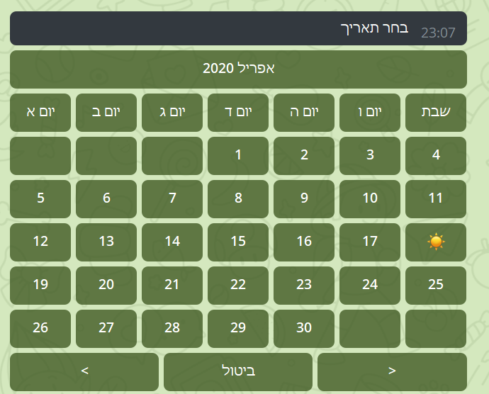
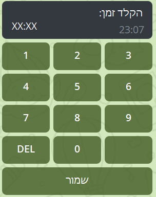

כאן תמצאו את כל המידע על התקשורת של הפיצ'ר שלכם עם הבוט.

<div dir="rtl" align="right">

[[_TOC_]]

</div>

## אובייקטי View

שליחת הודעה דרך הבוט תתבצע תמיד בשני שלבים. הראשון הוא יצירת אובייקט מסוג View. זהו אובייקט המייצג משהו שמוצג למשתמש. השלב השני הוא שליחת הview למשתמש.

יצירת View נעשית על ידי פעולות יעודיות שקיימות באובייקט self.ui.

לאחר שיצרתם View, שליחה שלו מתבצעת על ידי הפעולה draw.

ניתן לראות דוגמה לכך ב"שליחת הודעת טקסט".

## שליחת הודעות טקסט

יצירת View נעשית על ידי פעולות יעודיות שקיימות באובייקט self.ui. למשל, יצירת הודעת טקסט תתבצע על ידי השורה הבאה:


```python
msg = self.ui.create_text_view(session, text)
```

| פרמטר | הסבר |
| ------ | ------ |
| session | אובייקט session הרגיל, הוא תמיד מועבר לכם כפרמטר. |
| text | הטקסט שישלח בהודעה. | 

לאחר שיצרתם View, שליחה שלו מתבצעת על ידי הפעולה draw:

```python
msg.draw()
```

ניתן לכתוב את שתי הפעולות הללו בשורה אחת. למשל, אם היינו רוצים לשלוח את ההודעה "שלום" למשתמש, היינו כותבים:

```python
self.ui.create_text_view(session, "שלום").draw()
```

## שליחת קבוצת כפתורים

קבוצת כפתורים היא תצוגה של הודעה ומתחתיה כפתורים. יש לכם שליטה על מה יקרה כאשר כל כפתור נלחץ.

יצירת view של קבוצת כפתורים (או כפתור) ואז הציור שלה תתבצע באופן הבא:

```python 
msg = self.ui.create_button_group_view(session, text, buttons)
msg.draw()
```

| פרמטר | הסבר |
| ------ | ------ |
| session | אובייקט session הרגיל, הוא תמיד מועבר לכם כפרמטר. |
| text | הטקסט של ההודעה שהכפתורים ישלחו עליה. | 
| buttons | מערך של אובייקטים שנוצרו על ידי self.ui.create_button_view. | 

יצירת כפתורים למערך buttons מתבצעת על ידי הפעולה self.ui.create_button_view:

```python
self.ui.create_button_view(title, func_to_call)
```

| פרמטר | הסבר |
| ------ | ------ |
| func_to_call | הפונקציה שתיקרא כאשר המשתמש ילחץ על הכפתור. היא פונקציה עם פרמטר יחיד session שתיקרא כאשר משתמש ילחץ על הכפתור. היא יכולה להיות lambda. |
| title | הטקסט שיוצג על גבי הכפתור |

למשל, הקוד הבא לקוח מתוך הקוד של פיצ'ר עדכוני קורונה. הוא שולח קבוצת כפתורים ששואלת האם המשתמש רוצה לקבל מידע על כל המדינות או על מדינה ספציפית. 

```python
buttons = []
buttons.append(self.ui.create_button_view("מידע על כל המדינות יחדיו:", self.print_all_country_data))
buttons.append(self.ui.create_button_view("בחר מדינה ספציפית", self.get_specific_country_name))

self.ui.create_button_group_view(session, "מה ברצונך לראות?", buttons).draw()
```
מה אם אנחנו רוצים להעביר עוד מידע בלחיצת כפתור, למשל שם המדינה שנלחצה? במקרה כזה יש להשתמש בlambda. מחביאים את המידע הנוסף שרוצים להעביר לפונקציה בתוך lambda שמקבלת רק session כמו שצריך.
למשל, אם היינו רוצים שget_specific_country_name יקבל גם את המדינה שעליה רוצים לקבל מידע, היינו משתמשים בlambda באופן הבא:

```python
buttons = []
buttons.append(self.ui.create_button_view("מידע על גרמניה", lambda s: self.get_specific_country_name(s, "germany")))
buttons.append(self.ui.create_button_view("מידע על ישראל", lambda s: self.get_specific_country_name(s, "israel")))

self.ui.create_button_group_view(session, "מה ברצונך לראות?", buttons).draw()
```

שימו לב שבמקרה זה הlambda היא עדיין פונקציה שמקבלת רק session, אבל היא קוראת לפונקציה שמקבלת עוד פרמטרים.

חשוב לציין! היצירה ושליחה של כפתור לא עוצרים את הרצת הפיצ'ר שלכם. למשל הקוד הבא לא יעבוד:

```python
buttons = []
buttons.append(self.ui.create_button_view("מידע על גרמניה", lambda s: self.print_all_country_data(s, "germany")))
buttons.append(self.ui.create_button_view("מידע על ישראל", lambda s: self.get_specific_country_name(s, "israel")))

self.ui.create_button_group_view(session, "מה ברצונך לראות?", buttons).draw()
self.ui.create_text_view(session, "לחצת על כפתור!").draw()
```
הודעת הטקטס "לחצת על כפתור" תישלח מיד לאחר שליחת הכפתורים, היא לא תחכה למשתמש שילחץ על כפתור! על מנת שמשהו יקרה רק לאחר לחיצה על כפתור, הקוד צריך להיות בפונקציה נפרדת בcallback של הכפתורים, כמו שהודגם קודם.


## קבלת מידע על לחיצת כפתור

על מנת לעשות משהו כשלוחצים על כפתור, יש לממש את הפונקציה שהעברתם בfunc_to_call. למשל, בדוגמה מהפרק "שליחת קבוצת כפתורים":

```python
def main(self, session: Session):
    buttons = []
    buttons.append(self.ui.create_button_view("מידע על גרמניה", lambda s: self.get_specific_country_data(s, "germany")))
    buttons.append(self.ui.create_button_view("מידע על ישראל", lambda s: self.get_specific_country_data(s, "israel")))

    self.ui.create_button_group_view(session, "מה ברצונך לראות?", buttons).draw()

def get_specific_country_data(self, session: Session, country: str):
    data = self.data[country]
    self.ui.create_text_view(session, data).draw() 

```
שימו לב ששני הכפתורים קוראים לפונקציה get_specific_country_data, אבל עם פרמטר אחר, שמועבר על ידי הלמבדה. כשהמשתמש ילחץ על הכפתור שאומר "מידע על גרמניה" הפונקציה תיקרא עם הפרמטר גרמניה, וכנ"ל אם הוא לוחץ על ישראל.

## שליחת תמונה

יצירת הודעת תמונה תתבצע על ידי השורה הבאה:

```python
msg = self.ui.create_image_view(session, title, img_src)
```

| פרמטר | הסבר |
| ------ | ------ |
| session | אובייקט session הרגיל, הוא תמיד מועבר לכם כפרמטר. |
| title | הטקסט שישלח מתחת לתמונה כתיאור | 
| img_src | המיקום של התמונה. הוא צריך להיות פשוט השם של התמונה כולל הסייומת. | 


```python

self.ui.create_image_view(session, "תפוח", "apple.png").draw()

```

## שליחת לוח שנה

יצירת view של לוח שנה (בחירת תאריך) ואז הציור שלה תתבצע באופן הבא:

```python 
msg = self.ui.create_date_choose_view(session, choose_callback, chosen_date)

msg.draw()
```

| פרמטר | הסבר |
| ------ | ------ |
| session | אובייקט session הרגיל, הוא תמיד מועבר לכם כפרמטר. |
| choose_callback | הפונקציה שתיקרא כאשר המשתמש משנה את הבחירה של התאריך בלוח השנה. | 
| chosen_date | התאריך שיהיה מסומן בהתחלה, כאשר הלוח נשלח למשתמש. יכול להיות None ואז לא יהיה יום נבחר בהתחלה. | 



לאחר שליחת לוח שנה, כאשר המשתמש יבחר תאריך הפונקציה choose_callback תיקרא עם הפרמטרים הבאים:


| פרמטר | הסבר |
| ------ | ------ |
| view | מצביע לDateChooseView הספציפי שעליו המשתמש לחץ, למקרה שלא שמרתם אותו בעצמכם ואתם רוצים לערוך אותו לאחר לחיצה.|
| session | אובייקט session הרגיל | 
| date | התאריך שנבחר. | 

קטע הקוד הבא ישלח למשתמש את התאריך שהוא בחר:

```python 

def main(self, session: Session) -> None:
     msg = self.ui.create_date_choose_view(session, self.choose_callback, None)

     msg.draw()

def choose_callback(self, view, session, date):
    self.ui.create_text_view(session, str(date)).draw()

```

## שליחת שעון

יצירת view של שעון (בחירת שעה) ואז הציור שלה תתבצע באופן הבא:

```python 
msg = self.ui.create_time_choose_view(session, choose_callback, chosen_time)

msg.draw()
```

| פרמטר | הסבר |
| ------ | ------ |
| session | אובייקט session הרגיל, הוא תמיד מועבר לכם כפרמטר. |
| choose_callback | הפונקציה שתיקרא כאשר המשתמש משנה את הבחירה של התאריך בלוח השנה. | 
| chosen_time | שעה שתהיה מסומנת בהתחלה, כאשר השעון נשלח. | 




קטע הקוד הבא ישלח למשתמש את הזמן שהוא בחר:

```python 

def main(self, session: Session) -> None:
     msg = self.ui.create_time_choose_view(session, self.choose_callback, None)
     msg.draw()

def choose_callback(self, view, session, time):
    self.ui.create_text_view(session, str(time)).draw()

```


## קבלת טקסט מהמשתמש

קבלת טקסט מהמשתמש מתבצעת על ידי הפעולה self.ui.get_text באופן הבא:

```python

self.ui.get_text(session, func_to_call)

```

| פרמטר | הסבר |
| ------ | ------ |
| session | אובייקט session הרגיל, הוא תמיד מועבר לכם כפרמטר. |
| func_to_call | פונקציה שתיקרא כאשר המשתמש יקליד משהו לבוט. הפונקציה צריכה לקבל session ועוד משתנה text שיכיל את הטקסט שהמשתמש כתב. | 

למשל, אם נרצה שכאשר המשתמש יכתוב משהו, והבוט יענה לו אותו דבר:

```python

self.ui.get_text(session, self.echo_text)

def echo_text(self, session, text):
    self.ui.create_text_view(session, text).draw()

```

הפונקציה func_to_call יכולה להיות lambda.


שימו לב! בדומה לשליחת כפתורים, הקוד שמופיע לאחר draw יתבצע מיד לאחר שהפקודה get_text נקראת, הרצת הקוד לא תיעצר עד קבלת טקטס, היא תמשיך עד הסוף. כדי שמשהו יקרה רק לאחר קבלת טקסט מהמשתמש, הוא חייב להיות בתוך הפונקציה שמועברת בfunc_to_call.

## קבלת תמונה מהמשתמש

קבלת תמונה מהמשתמש מתבצעת על ידי הפעולה self.ui.get_photo באופן הבא:
```python

self.ui.get_photo(session, func_to_call)

```

השימוש זהה לקבלת טקסט מהמשתמש (ראו פרק קודם), רק שהפעם במקום שהפונקציה func_to_call תקבל טקסט שהמשתמש הקליד, היא תקבל תמונה.

התמונה שמוחזרת היא אובייקט מסוג file שאי אפשר לעבוד איתו - צריך להוריד את התמונה עצמה. עושים את זה על ידי file.download. למשל, קטע הקוד הבא יקבל תמונה מהמשתמש וישמור אותו בתור image.png:

```python

def main(self, session: Session):
    self.ui.get_photo(session, self.get_photo)

def get_photo(self, session: Session, photo: telegram.File):
    photo_path = str("image.png")
    photo.download(custom_path=photo_path)

```

## שליחת רשימת שמות הכי דומים (בדומה לפיצ'ר arp)

שליחת רשימת שמות הכי דומים לטקסט מסויים מתוך מאגר של אובייקטים והשם שלהם נעשית על ידי אובייקטים מסוג ClosestNameActivity.

יצירת אובייקט תיעשה על ידי ui.create_closest_name_view:

```python
self.ui.create_closest_name_view(session, objects, key, count, func_to_call, try_again)
```

| פרמטר | הסבר |
| ------ | ------ |
| session | אובייקט session הרגיל, הוא תמיד מועבר לכם כפרמטר. |
| objects | מילון שמתאים שם לכל אובייקט. יוחזו לfunc_to_call רשימה של אובייקט שהשם שמתאים לו הכי קרוב לkey|
| key | השם לחיפוש מתוך המילון |
| count | כמות האפשרויות שיש להציג |
| func_to_call | פונקציה שתיקרא כאשר המשתמש יבחר אופציה. הפונקציה צריכה לקבל session ועוד משתנה o שיכיל את האובייקט עם השם שנבחר. | 
| try again | פונקציה שתיקרא אם המשתמש ילחץ על כפתור 'נסה שנית'. צריכה לקבל רק session. |

דוגמה לשימוש בclosest_name_view מתוך arp להלן:
```python

users = User.objects

data = {}
for user in users:
   data[user] = user.name

def try_again(s: Session) -> None:
    """
    This function call after the user press the try again button
    :return: None
    """
    self.ui.clear(s)
    self.main(s)

self.ui.create_closest_name_view(session, data, name, 5, lambda s,u: self.button_pressed(s, u), try_again).draw()

```
השורה הראשונה מקבלת את כל המשתמשים הקיימים.

לולאת הfor יוצרת מילון שמתאים לכל משתמש את השם שלו.
פונקציית הtry_again היא פונקציה שקוראת לפעולה הקודמת main.
השורה האחרונה יוצרת closest_name_activity עם הsession הנוכחי, עם המילון של המשתמשים והשמות שלהם, עם השם שמחפשים, עם 5 אפשרויות בחירה, ופונקציה שקוראת לפעולה הבאה button_pressed עם המשתמש שנבחר.


## ביצוע פעולה בזמן קבוע בעתיד

ביצוע פעולה בזמן קבוע בעתיד (למשל, כל שעה, או כל יום ראשון בשעה 3:00) תתבצע על ידי אובייקט Job. אובייקט Job מורכב משלושה מרכיבים: הפונקציה שתיקרא בזמן מסויים, הפרמטרים שהיא תקבל כשהיא תיקרא, והזמן שבו היא תיקרא.


ניתן ליצור Job קבוע רק במקום אחד, בפונקציית הget_scheduled_jobs. זוהי פונקציה שנמצאת בכל פיצ'ר ומחזירה רשימה של Jobים קבועים של הפיצ'ר. 

למשל, אם נרצה להכין פיצ'ר ששולח "בוקר טוב" לכל המתלם כל בוקר בשעה 7:00, נכתוב את הקוד הבא בתוך המחלקה good_morning.py (המחלקה של הפיצ'ר).

```python

def main(self, session: Session):
    self.ui.create_text_view(session, "בוקר טוב!").draw()

def get_scheduled_jobs(self) -> [ScheduledJob]:
    jobs = []
    for user in get_connection()['users_info'].find():
        jobs.append(ScheduledJob(lambda: self.main(Session("good_morning", user)), [], day="*", hour="7"))

    return jobs

```


 הפונקציה main בסך הכל שולחת הודעת טקסט למשתמש בsession כמו שעשינו עד עכשיו. מה שגורם לmain להיקרא לכל משתמש כל בוקר הוא הפונקציה get_scheduled_jobs. נעבור עליה שורה שורה.


קודם כל, יוצרים מערך jobs ריק.

אחר כך, עוברים על כל user על ידי קריאה מהdb. 

לכל user, מוסיפים למערך Job חדש. הפרמטר הראשון שלו הוא פרמטר חובה המייצג את הפונקציה שתיקרא. כאן השתמשנו בlambda שקורא לself.main עם session שמתאים למשתמש שכרגע עובדים איתו. הפרמטר השני (רשימה ריקה) הוא רשימת הפרמטרים שיועברו לפונקציה. כאן השתמשנו בlambda שלא מקבלת פרמטרים ולכן מעבירים רשימה ריקה. כל פרמטר נוסף לאחר שני הפרמטרים החובה הללו מציין זמן שבו הפעולה תיקרא. כאן הכוכבית בday אומר כל יום, וה3 בhour אומר בשעה 3 בבוקר. ניתן לראות פירוט מלא על מצייני זמן [כאן](https://apscheduler.readthedocs.io/en/stable/modules/triggers/cron.html).

## שליחת הודעה למשתמש אחר

ניתן לשלוח הודעות גם למשתמשים שאינם המשתמש ששלח את ההודעה. 

על מנת לעשות זאת, יש ליצור אובייקט Session חדש עבור הuser שאליו נרצה לשלוח הודעה. למשל, נדגים קיצד ניתן ליצור פיצ'ר annoy ששולח הודעה לכל המשתמשים מהמחזור של מי שהפעיל אותו.

```python

    def main(self, session: Session) -> None:
        users = UserConstraint.get_users_with_constraint(MachzorConstraint(session.user.mahzor))
        txt = session.user.name + " annoyed you!"
        
        for user in users:
            user_session = Session.create_session('annoy', user)
            self.ui.create_text_view(user_session, txt).draw()

        self.ui.create_text_view(session, "הצקתי לכולם").draw()

```

נעבור על קטע הקוד שורה שורה. ראשית, הוא נמצא בפונקציית main של הפיצ'ר, כלומר הוא מתבצע כאשר מישהו בוחר בפיצ'ר בתפריט הראשי. 

השורה הראשונה מוצאת את כל המשתמשים מהמחזור של המשתמש שהתחיל את הפיצ'ר.

השורה השנייה יוצרת את הטקסט שישלח לכל המשתמשים.

לולאת הfor עוברת על כל משתמש במחזור. לכל משתמש היא יוצרת session חדש על ידי הפעולה הבאה:

```python

Session.create_session(feature_name, user)

```

| פרמטר | הסבר |
| ------ | ------ |
| feature_name | שם הפיצ'ר שיוצר את הsession. צריך להיות זהה לשם הפיצ'ר שאתם כותבים. |
| user| המשתמש שעבורו תיווצר הsession, אובייקט מסוג User | 

לאחר יצירת הsession החדש, שולחים למשתמש על גבי הsession החדש את ההודעה. שימו לב להעברת הפרמטר user_session שנוצר עבור המשתמש הספציפי שאליו שולחים הודעה.

לבסוף, לאחר שליחת הודעה לכל המשתמשים במחזור, שולחים הודעה גם למשתמש המקורי שפתח את הפיצ'ר. הפעם מעבירים את הsession המקורי, שמשויך תמיד למשתמש שיזם את פתיחת הפיצ'ר.